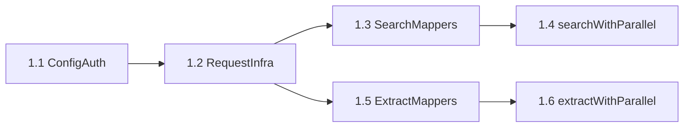

# Decompose L/M Tasks

Break the 4 Large/Medium Parallel integration tasks into 22 small, dependency-ordered subtasks (each ~15–90 min) so spine can implement and review incrementally with clear checkpoints.

# Decompose Large and Medium Parallel Tasks

## Current state

The original plan had **4 L/M tasks** totaling ~10–16 hrs:

| ID | Size | Original scope |
|----|------|----------------|
| `parallel-ts` | **L** | Full REST client (search + extract + config) |
| `gemini-search` | **M** | Provider routing in [`gemini-search.ts`](gemini-search.ts) |
| `index-routing` | **M** | Provider wiring in [`index.ts`](index.ts) |
| `tests` | **M** | Mocked unit tests |

Small tasks (`extract-fallback`, `curator-ui`, `docs-changelog`) are already atomic and need no further split.

## Decomposition principle

Each subtask should be:
- **Independently reviewable** (one concern, one PR commit if desired)
- **Runnable checkpoint** where possible (compile + `npm test` after each phase)
- **Sized S** (~15–45 min) or **XS** (~15 min) — no subtask over 90 min

Reference patterns:
- Config/auth: [`perplexity.ts`](perplexity.ts) L42–105
- Search mappers: [`exa.ts`](exa.ts) L145–220, L472–510
- Routing: [`gemini-search.ts`](gemini-search.ts) L108–189
- Curator resolution: [`index.ts`](index.ts) L151–194, L1104–1106

---

## Phase 1: `parallel.ts` foundation (was **L**, now 6 subtasks)



### 1.1 Config and availability — **S** (~30 min)

**File:** new [`parallel.ts`](parallel.ts)

- Constants: `PARALLEL_SEARCH_URL`, `PARALLEL_EXTRACT_URL`, `CONFIG_PATH`
- `loadConfig()` with module cache (mirror [`perplexity.ts`](perplexity.ts) L42–57)
- `normalizeApiKey()`, `getApiKey()` — reads `PARALLEL_API_KEY` env then `parallelApiKey` from `~/.pi/web-search.json`
- Exports: `isParallelAvailable()`, `hasParallelApiKey()`
- Clear setup error message pointing to `platform.parallel.ai`

**Done when:** module imports without side effects; `isParallelAvailable()` returns false with no config.

### 1.2 Shared request infrastructure — **XS** (~20 min)

**File:** [`parallel.ts`](parallel.ts)

- `requestSignal(signal?)` — 60s timeout via `AbortSignal.any` (copy from [`exa.ts`](exa.ts) L140–143)
- `errorMessage()`, abort detection helper
- `parallelFetch(url, body, signal)` wrapper: `x-api-key` header, JSON body, activityMonitor start/complete/error

**Done when:** shared fetch helper exists; no search/extract logic yet.

### 1.3 Search option + response mappers — **S** (~45 min)

**File:** [`parallel.ts`](parallel.ts)

Pure functions (unit-testable without network):

| Helper | Maps to Parallel API |
|--------|---------------------|
| `recencyToAfterDate(filter)` | `advanced_settings.source_policy.after_date` (YYYY-MM-DD; same day/week/month/year offsets as [`exa.ts`](exa.ts) L145–155) |
| `mapDomainFilter(domainFilter)` | `include_domains` / `exclude_domains` (same `-` prefix convention as Exa L157–169) |
| `buildSearchRequestBody(query, options)` | `objective`, `search_queries: [query]`, `advanced_settings.max_results`, source_policy |
| `mapSearchResults(results)` | `{ title, url, snippet }[]` from `V1WebSearchResult` |
| `buildAnswerFromExcerpts(results)` | stitch excerpts + `Source: {title} ({url})` (mirror Exa `buildAnswerFromSearchResults` L177–191) |
| `mapInlineContent(results)` | `ExtractedContent[]` from excerpts when `includeContent: true` |

**Done when:** mappers have no fetch dependency; ready for test coverage in Phase 4.

### 1.4 `searchWithParallel()` — **S** (~60 min)

**File:** [`parallel.ts`](parallel.ts)

- `POST https://api.parallel.ai/v1/search`
- Wire mappers from 1.3; honor `numResults` (default 5, max 20), `recencyFilter`, `domainFilter`, `includeContent`, `signal`
- Return `SearchResponse` (import types from [`perplexity.ts`](perplexity.ts))
- Strict errors on missing key, non-2xx, invalid JSON

**Done when:** callable in isolation with a real or mocked key.

### 1.5 Extract response mappers — **XS** (~25 min)

**File:** [`parallel.ts`](parallel.ts)

- `mapExtractResult(result)` → `{ url, title, content }` — prefer `full_content`, else join `excerpts`
- Return `null` when content length &lt; 500 (`MIN_USEFUL_CONTENT` from [`extract.ts`](extract.ts))

**Done when:** pure function handles excerpts-only, full_content, empty, and error responses.

### 1.6 `extractWithParallel()` — **S** (~45 min)

**File:** [`parallel.ts`](parallel.ts)

- `POST https://api.parallel.ai/v1/extract` with `urls: [url]`, optional `objective` from `options.prompt`
- Use shared fetch from 1.2; return `ExtractedContent | null`
- Handle per-URL errors in `errors[]` array (return null, don't throw for fetch failures)

**Done when:** extract path complete; Phase 1 module fully exported.

---

## Phase 2: Search routing (was **M** `gemini-search`, now 4 subtasks)

**File:** [`gemini-search.ts`](gemini-search.ts)

### 2.1 Type and config normalization — **XS** (~15 min)

- Add `"parallel"` to `SearchProvider` and `ResolvedSearchProvider`
- Extend `normalizeSearchProvider()` L58–62 to accept `"parallel"`
- Import `isParallelAvailable`, `searchWithParallel` from `./parallel.js`

### 2.2 Explicit `provider: "parallel"` branch — **XS** (~20 min)

Insert before existing perplexity branch (~L112):

```typescript
if (provider === "parallel") {
  const result = await searchWithParallel(query, options);
  return { ...result, provider: "parallel" };
}
```

Strict: no fallback when explicit (missing key throws from `getApiKey()`).

### 2.3 Auto-chain slot — **S** (~30 min)

Insert after Exa block (~L151–159), before Perplexity (~L161):

```
Exa → Parallel → Perplexity → Gemini
```

- Guard: `provider !== "parallel" && isParallelAvailable()`
- Success: result has `answer` or `results.length > 0`
- Failure: append to `fallbackErrors`, continue chain

### 2.4 Error message updates — **XS** (~15 min)

- Update final "No search provider available" block L183–188 to mention `parallelApiKey` / `PARALLEL_API_KEY`
- Update auto-failure message if needed

**Phase 2 done when:** `search({ provider: "parallel" })` and auto-chain work end-to-end.

---

## Phase 3: Index provider wiring (was **M** `index-routing`, now 5 subtasks)

**File:** [`index.ts`](index.ts)

### 3.1 `ProviderAvailability` type — **XS** (~10 min)

- Add `parallel: boolean` to interface L55–59
- Import `isParallelAvailable` from `./parallel.js`

### 3.2 `getProviderAvailability()` — **XS** (~10 min)

- Add `parallel: isParallelAvailable()` to return object L151–157

### 3.3 `normalizeProviderInput()` — **XS** (~10 min)

- Add `"parallel"` to allowed values L117

### 3.4 `resolveProvider()` auto-order + fallbacks — **S** (~45 min)

Four changes in L169–194:

**Auto order** (insert Parallel after Exa):
```
exa → parallel → perplexity → gemini
```

**Unavailable-provider branches** — add `parallel` case mirroring exa/perplexity/gemini:
- When `provider === "parallel" && !available.parallel` → fall through exa → perplexity → gemini
- When other providers unavailable → include parallel in fallback order

This is the most error-prone subtask; verify all 4 existing branches updated consistently.

### 3.5 Tool schema + description — **XS** (~15 min)

- `web_search` `StringEnum` L1105: add `"parallel"`
- Update tool description L1091–1092: mention Parallel and auto order `Exa → Parallel → Perplexity → Gemini`

Note: `/websearch` slash command uses `normalizeProviderInput()` via `onProviderChange` L2094 — no separate enum; covered by 3.3.

**Phase 3 done when:** curator bootstrap receives `availableProviders.parallel`; tool schema accepts `provider: "parallel"`.

---

## Phase 4: Tests (was **M**, now 5 subtasks)

**File:** new [`test/parallel.test.mjs`](test/parallel.test.mjs)

Follow spawn + temp `HOME` pattern from [`test/gemini-web-cookie-opt-in.test.mjs`](test/gemini-web-cookie-opt-in.test.mjs).

### 4.1 Test harness — **S** (~45 min)

- `mkdtemp` HOME helper
- `runWithHome(home, script)` spawn wrapper
- Global `fetch` mock injection strategy (override in spawned `--input-type=module` script, or use undici MockAgent if available without new deps)

**Decision:** prefer spawn + inline fetch mock in child process to avoid adding test dependencies.

### 4.2 Availability tests — **XS** (~20 min)

- `isParallelAvailable()` → `false` with empty HOME
- `isParallelAvailable()` → `true` with `{ parallelApiKey: "test" }` in `~/.pi/web-search.json`
- `isParallelAvailable()` → `true` with `PARALLEL_API_KEY` env

### 4.3 Search mapper tests — **S** (~45 min)

Test pure mapping via exported helpers or by mocking `/v1/search` response:

- Sample `V1SearchResponse` JSON → correct `answer`, `results`, `inlineContent`
- Empty results → empty answer
- Domain/recency options → correct request body fields (inspect mock call args)

### 4.4 Extract mapper tests — **S** (~40 min)

- Mock `/v1/extract` with `full_content` → `ExtractedContent`
- Excerpts-only response → joined content
- Content &lt; 500 chars → `null`
- URL in `errors[]` → `null`

### 4.5 Routing integration smoke — **S** (~30 min)

- `normalizeSearchProvider("parallel")` returns `"parallel"`
- Auto chain: with only Parallel key configured, mock confirms `/v1/search` called before Perplexity/Gemini paths
- Auto chain: without Parallel key, no fetch to `api.parallel.ai`

**Phase 4 done when:** `npm test` passes with no live API key.

---

## Updated task inventory

| Phase | Subtask | Size | Est. | Depends on |
|-------|---------|------|------|------------|
| 1 | 1.1 Config/auth | S | 30m | — |
| 1 | 1.2 Request infra | XS | 20m | 1.1 |
| 1 | 1.3 Search mappers | S | 45m | 1.1 |
| 1 | 1.4 searchWithParallel | S | 60m | 1.2, 1.3 |
| 1 | 1.5 Extract mappers | XS | 25m | 1.1 |
| 1 | 1.6 extractWithParallel | S | 45m | 1.2, 1.5 |
| 2 | 2.1 Types/imports | XS | 15m | 1.4 |
| 2 | 2.2 Explicit branch | XS | 20m | 2.1 |
| 2 | 2.3 Auto-chain | S | 30m | 2.1 |
| 2 | 2.4 Error messages | XS | 15m | 2.3 |
| 3 | 3.1 Availability type | XS | 10m | 1.1 |
| 3 | 3.2 getProviderAvailability | XS | 10m | 3.1 |
| 3 | 3.3 normalizeProviderInput | XS | 10m | — |
| 3 | 3.4 resolveProvider | S | 45m | 3.2, 3.3 |
| 3 | 3.5 Tool schema | XS | 15m | 3.3 |
| 4 | 4.1 Test harness | S | 45m | 1.4, 1.6 |
| 4 | 4.2 Availability tests | XS | 20m | 4.1 |
| 4 | 4.3 Search mapper tests | S | 45m | 4.1, 1.3 |
| 4 | 4.4 Extract mapper tests | S | 40m | 4.1, 1.5 |
| 4 | 4.5 Routing smoke | S | 30m | 4.1, 2.3, 3.4 |

**22 subtasks total** — all XS or S. No subtask exceeds 60 min.

---

## Recommended implementation order for spine

**Day 1 morning:** 1.1 → 1.2 → 1.3 → 1.4 (search works)  
**Day 1 afternoon:** 1.5 → 1.6 → 2.1 → 2.2 → 2.3 → 2.4 (routing works)  
**Day 2 morning:** 3.1–3.5 + small tasks `extract-fallback`, `curator-ui` (not decomposed)  
**Day 2 afternoon:** 4.1 → 4.2 → 4.3 → 4.4 → 4.5 + `docs-changelog`

---

## Checkpoint commands after each phase

```bash
cd /Users/cdelgado/Documents/github/pi-web-access && npm test
```

After Phase 1+2: manual smoke with `parallelApiKey` in `~/.pi/web-search.json` and `provider: "parallel"`.

---

## Out of scope for this decomposition

- Extracting shared `recencyToStartDate` / `mapDomainFilter` into a utils module (optional refactor; duplicate in `parallel.ts` matches existing provider isolation)
- `code_search`, Deep Research, `parallel-cli` subprocess
- Session ID chaining between search and extract calls

