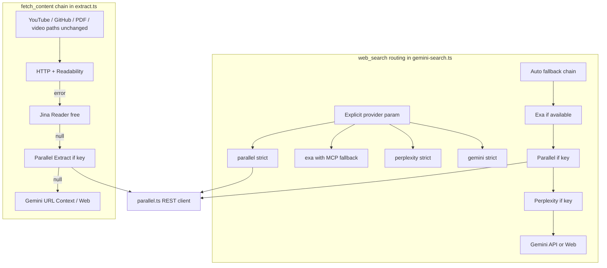

# Parallel Provider Integration

Add Parallel as a first-class `web_search` provider (explicit + auto fallback chain) and as a credentialed `fetch_content` fallback step, following the same patterns as Exa/Perplexity/Gemini. REST API only — no `parallel-cli` dependency.

# Add Parallel Search + Extract to pi-web-access

## Goal

Integrate [Parallel](https://parallel.ai) as a peer provider in pi-web-access:

- **`web_search`**: explicit `provider: "parallel"` + auto-chain fallback (same semantics as Exa/Perplexity/Gemini)
- **`fetch_content`**: implicit fallback slot when HTTP/Readability and Jina fail (same pattern as Gemini extract)
- **Curator UI**: provider button, tags, alt-provider chips
- **Config/docs/tests**: complete surface area, not a personal workaround

## Architecture



## Auto-chain ordering (document in README)

Preserve zero-config Exa MCP; insert Parallel after Exa:

**Exa → Parallel → Perplexity → Gemini**

Same ordering in:
- [`gemini-search.ts`](gemini-search.ts) auto fallback block (~L149–177)
- [`index.ts`](index.ts) `resolveProvider()` for curator default (~L175–179)
- [`index.ts`](index.ts) unavailable-provider fallback branches (~L181–192)

## API mapping

### Search — `POST https://api.parallel.ai/v1/search`

| pi-web-access | Parallel API |
|---|---|
| `query` | `objective` + `search_queries: [query]` |
| `numResults` | `advanced_settings.max_results` (default 5, cap 20) |
| `recencyFilter` | `advanced_settings.source_policy.after_date` (YYYY-MM-DD; reuse Exa's day/week/month/year offsets from [`exa.ts`](exa.ts) `recencyToStartDate`) |
| `domainFilter` | `advanced_settings.source_policy.include_domains` / `exclude_domains` (reuse Exa's `mapDomainFilter`) |
| `includeContent` | map `excerpts` → `inlineContent` (like Exa's `mapInlineContent`) |
| Auth | `x-api-key` header from `PARALLEL_API_KEY` or `parallelApiKey` in `~/.pi/web-search.json` |

**Answer synthesis**: Parallel returns excerpts, not prose. Stitch excerpts into `answer` using the same pattern as Exa's `buildAnswerFromSearchResults` in [`exa.ts`](exa.ts) (~L177–191): join excerpt text + `Source: {title} ({url})` per result.

### Extract — `POST https://api.parallel.ai/v1/extract`

| pi-web-access | Parallel API |
|---|---|
| `url` | `urls: [url]` |
| `options.prompt` | optional `objective` |
| Response | prefer `full_content`, else join `excerpts` |
| Gate | only when `isParallelAvailable()` (key present) |
| Min content | return `null` if content &lt; `MIN_USEFUL_CONTENT` (500) in [`extract.ts`](extract.ts) |

**Do not** shell out to `parallel-cli`. Call REST directly like [`perplexity.ts`](perplexity.ts) and [`exa.ts`](exa.ts).

## File-by-file changes

### 1. New [`parallel.ts`](parallel.ts) (~180–250 lines)

Mirror [`perplexity.ts`](perplexity.ts) structure:

**Exports**
- `isParallelAvailable(): boolean`
- `hasParallelApiKey(): boolean`
- `searchWithParallel(query, options): Promise<SearchResponse>`
- `extractWithParallel(url, signal, options?): Promise<ExtractedContent | null>`

**Internals**
- Config load from `~/.pi/web-search.json` with module-level cache (same as other providers)
- `getApiKey()` throws clear setup message (like Perplexity)
- `activityMonitor.logStart/logComplete/logError` on all API calls
- Abort-aware `fetch` with 60s timeout (`AbortSignal.any` pattern from Exa)
- Response types for `V1SearchResponse` / `V1ExtractResponse`
- Helpers: `mapDomainFilter`, `recencyToAfterDate`, `buildAnswerFromExcerpts`, `mapSearchResults`, `mapInlineContent`

**Explicit provider behavior**: strict — missing key throws; API errors propagate (no silent fallback when `provider: "parallel"`).

### 2. [`gemini-search.ts`](gemini-search.ts)

- Extend `SearchProvider` / `ResolvedSearchProvider` with `"parallel"`
- Update `normalizeSearchProvider()` (~L58–62)
- Add explicit branch before auto fallback:

```typescript
if (provider === "parallel") {
  const result = await searchWithParallel(query, options);
  return { ...result, provider: "parallel" };
}
```

- Insert into auto chain after Exa, before Perplexity (~L151–169):

```typescript
if (provider !== "parallel" && isParallelAvailable()) {
  try {
    const result = await searchWithParallel(query, options);
    if (result?.answer || result?.results?.length) return { ...result, provider: "parallel" };
  } catch (err) { /* collect fallbackErrors */ }
}
```

- Update final "no provider" error (~L183–188) to mention `parallelApiKey` / `PARALLEL_API_KEY`

### 3. [`extract.ts`](extract.ts)

Insert Parallel between Jina and Gemini (~L419–426):

```typescript
if (isParallelAvailable()) {
  const parallelResult = await extractWithParallel(url, signal, options);
  if (parallelResult) return parallelResult;
}
```

Update final fallback guidance (~L437–444) to mention Parallel API key option.

**Do not** touch specialized paths (YouTube, GitHub, PDF, local video).

### 4. [`index.ts`](index.ts)

| Location | Change |
|---|---|
| `ProviderAvailability` (~L55–59) | Add `parallel: boolean` |
| `getProviderAvailability()` (~L151–157) | `parallel: isParallelAvailable()` |
| `normalizeProviderInput()` (~L113–120) | Accept `"parallel"` |
| `resolveProvider()` (~L169–194) | Auto order + unavailable fallbacks for `parallel` |
| `web_search` `StringEnum` (~L1104–1106) | Add `"parallel"` |
| `web_search` description (~L1091–1092) | Mention Parallel in provider list and auto-select order |
| `/websearch` slash command (~L2094+) | Same provider enum if duplicated |

Import `isParallelAvailable` from `./parallel.ts`.

### 5. [`curator-page.ts`](curator-page.ts)

- Extend `availableProviders` type with `parallel`
- Add to `buildProviderButtons` providers array (~L15–18): `{ value: "parallel", label: "Parallel", available: available.parallel }`
- Add CSS `.provider-tag.provider-parallel` (~L629–644)
- Add `"parallel"` to JS `providers` array (~L1367)
- Add `providerLabel("parallel")` → `"Parallel"` (~L1563–1566)

### 6. [`curator-server.ts`](curator-server.ts)

- Extend `availableProviders` type (~L15)
- Add `parallel` case in `isAvailableProvider()` (~L228–231)

### 7. [`README.md`](README.md)

- Zero-config section: note Parallel requires API key (unlike Exa MCP)
- Config example: add `"parallelApiKey": "..."` and `"provider": "parallel"`
- `web_search` params table: add `parallel` to provider enum
- Env vars: `PARALLEL_API_KEY`
- Auto-chain explanation: Exa → Parallel → Perplexity → Gemini
- Note excerpt-style answers (like Exa search path, not Perplexity prose)
- `fetch_content` fallback chain: mention Parallel step when key configured
- Files table: add `parallel.ts` entry (~L331)

### 8. [`CHANGELOG.md`](CHANGELOG.md)

Under `[Unreleased]`:

```markdown
### Added
- Parallel search provider via REST API (`provider: "parallel"` or auto-chain after Exa).
- Parallel Extract fallback in `fetch_content` when HTTP/Jina fail and `parallelApiKey` is configured.
```

### 9. New [`test/parallel.test.mjs`](test/parallel.test.mjs)

Follow existing test style in [`test/gemini-web-cookie-opt-in.test.mjs`](test/gemini-web-cookie-opt-in.test.mjs) — spawn Node with mocked `fetch` or import helpers with temp `HOME`:

| Test case | Assert |
|---|---|
| `normalizeProviderInput("parallel")` resolves correctly | via spawn/import of index helpers or gemini-search |
| Search response mapping | mock `/v1/search` JSON → `answer` + `results` + `inlineContent` |
| Extract response mapping | mock `/v1/extract` JSON → `ExtractedContent` |
| `isParallelAvailable()` false without key | returns false |
| Auto chain skips Parallel when no key | no fetch to parallel.ai |

No live API key in CI.

## Out of scope (separate PRs)

- **`code_search`** — still Exa MCP in [`code-search.ts`](code-search.ts)
- **Deep Research / Enrichment / FindAll APIs** — different async product surface
- **`parallel-cli` subprocess** — wrong fit for npm package
- **Session ID chaining** between search + extract — optional future enhancement
- **Reordering Exa below Parallel globally** — breaks zero-config story

## Acceptance criteria

1. `web_search({ query: "...", provider: "parallel" })` works with `parallelApiKey` configured
2. `provider: "auto"` tries Parallel after Exa fails/unavailable, before Perplexity
3. Curator shows Parallel button when key present; provider tags render correctly
4. `fetch_content` tries Parallel after Jina when key present, before Gemini
5. Missing Parallel key + explicit provider → clear error (not silent wrong provider)
6. Exa zero-config MCP unchanged
7. Tests pass: `npm test`
8. README + CHANGELOG updated

## Effort estimate

| Phase | Time |
|---|---|
| `parallel.ts` search client | 4–6 hrs |
| `parallel.ts` extract + `extract.ts` wiring | 2–3 hrs |
| `gemini-search.ts` + `index.ts` routing | 2–3 hrs |
| Curator UI (`curator-page.ts`, `curator-server.ts`) | 1–2 hrs |
| Tests | 2–3 hrs |
| Docs + CHANGELOG | 1 hr |
| **Total** | **~1.5–2 days** |

## Suggested PR title

`Add Parallel as search provider and fetch_content fallback`

## Implementation order

Work in dependency order to keep each commit runnable:

1. `parallel.ts` (search + extract + availability)
2. `gemini-search.ts` routing
3. `extract.ts` fallback
4. `index.ts` provider resolution + tool schema
5. Curator UI
6. Tests
7. README + CHANGELOG

